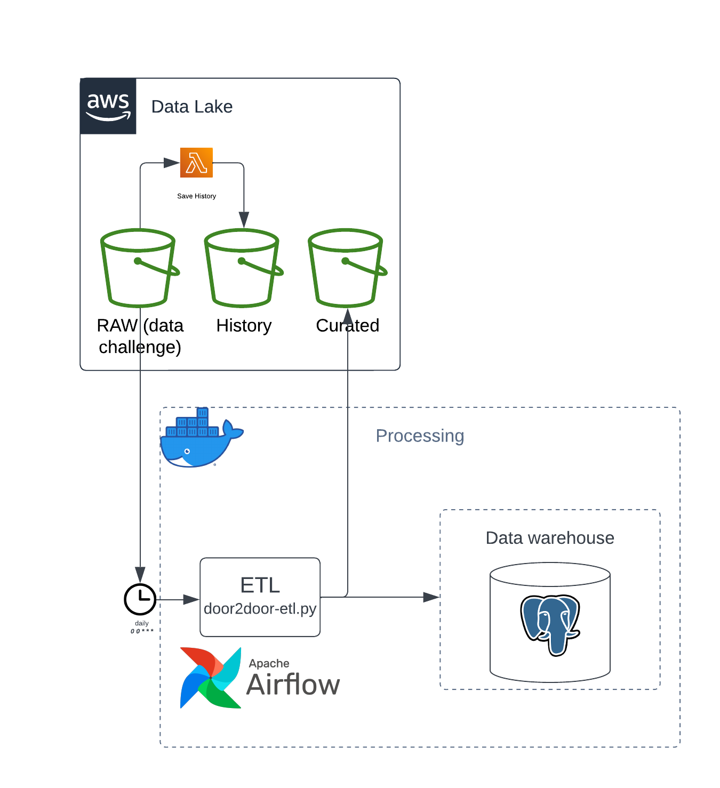

# Data engineer challenge
## Infrastructure
For this challenge I decide to use a hybrid infrastructure design, using AWS S3 as Data Lake and using docker to create the infrastructure needed for data processing and data warehousing solutions. Also I have created IAC in case the migration to the cloud is needed, using one or more EC2 instances the solution is designed to host airflow and Postgres in the cloud.


### Cloud infrastructure
The cloud infrastructure proposed is based on S3 as Data Lake, EC2 with docker and airflow instances as Staging and processing area and AWS Redshift for Data warehousing. The advantage of this is the faccility to scalate if needed and all the services like AWS lambda and Cloud watch to handle different scenarios or bussiness tech problems.


## ETL
For the ETL design I followed a functional design under this 3 principles:
1. Atomicity: *One* function should only perform *one* Task.
2. Idempotency: If you run your code multiple times, the output should be the same.
3. No side effects: Your function shouldn't affect any external data (variable or other) besides its output.

At the end I'll point some better code practices to have a more understandable and maintainable code.

So let's break the door2door-etl DAG:
### Extract
The extract function read all the json data for an specific date in the lake and downloads it to a temporary location inside the server for further processing.
```python
def _extract(ds):
    import s3fs

    fs = s3fs.S3FileSystem(anon=True)
    file_list = fs.ls(S3_BUCKET)
    for i in file_list:
        name = i.split("/")[2]
        if ds in i:
            fs3 = fs.open(i, 'r')
            with open(f"temp/{name}", 'w') as f:
                f.write(fs3.read())
```

### Transform
The transform function reads the data from the temporary location, load line by line to a python dictionary and apply transformations to get the data in a csv format. For this case I have only work on the *update* *vehicle* operation.
```python
def _get_update_location_data(line: dict):
    return f"""{line['data']['id']},\
            {line['data']['location']['lat']},\
            {line['data']['location']['lng']},\
            {line['data']['location']['at']}\n"""

def _transform(ds):
    import json

    _csvFile = open(f"temp/csv/output_{ds}.csv", "w")
    json_filter = [f for f in os.listdir("temp/") if f.endswith(".json")]
    for filename in json_filter:
        f = open(os.path.join("temp/", filename), 'r')
        data = f.readlines()
        for line in data:
            res = json.loads(line)
            if res["event"] == "update" and res["on"] == "vehicle":
                _csvFile.write(_get_update_location_data(res))
```

### Load
The load function reads the output CSV and perform a bulk insert of all the records to the data warehouse.
```python
def _load(ds):
    import csv

    import psycopg2

    try:
        conn = psycopg2.connect(
            database=WAREHOUSE_DB,
            user=WAREHOUSE_USER,
            password=WAREHOUSE_PASSWORD,
            host=WAREHOUSE_HOST,
            port=WAREHOUSE_PORT,
        )
        conn.autocommit = True
        cursor = conn.cursor()
        with open(f'temp/csv/output_{ds}.csv', 'r') as f:
            reader = csv.reader(f, skipinitialspace=True)
            for row in reader:
                cursor.execute(
                    "INSERT INTO vehicle.locationupdate \
                        VALUES(%s, %s, %s, %s)",
                    row,
                )
        conn.commit()
    except Exception as err:
        print(f"Error with the connection to Warehouse, {err}")
    finally:
        conn.close()
```
* For this function the *Atomicity* principle of the functional design is being violated because the function is performing 2 tasks, handle the DB connection and also performing the bulk insert. To solve that would be useful to write an utils package in which we can handle the DB connection and only returns the cursor to apply the insert.
* For the whole ETL the *Idempotency* principle is being violated because if we run multiple times for a unique date we would have duplicated records, there are 2 ways to handle this, the first one is to add a Primary key composed of the *vehicle id* and the *at timestamp* that will be a solution at the DB level and in code we can perform a *SELECT DISTINCT(at_timestamp)* and validate that if there is data for the date that we are working then delete that data.

## Code structure
```markdown
.
├── containers
│   └── airflow
│       ├── Dockerfile
│       └── requirements.txt
├── dags
│   ├── door2door-etl.py
│   └── __pycache__
│       └── door2door-etl.cpython-36.pyc
├── docker-compose.yml
├── images
│   └── DE-challenge.png
├── LICENSE
├── logs
│   ├── dag_processor_manager
│   │   └── dag_processor_manager.log
│   └── scheduler
│       ├── 2023-03-13
│       ├── 2023-03-14
│       │   └── door2door-etl.py.log
│       └── latest -> /opt/airflow/logs/scheduler/2023-03-14
├── Makefile
├── migrations
│   ├── 0000_initial_schema.py
│   └── 0001_create_tables.py
├── plugins
├── README.md
├── temp
├── terraform
│   ├── main.tf
│   ├── output.tf
│   └── variable.tf
└── tests
```
1. The **containers** folder has all the Dockerfiles used for different services.
2. The **dags, logs, plugins, temp and tests** folders are mounted volumes that work between the airflow webserver and the local code.
3. About the **migrations** folder, I'm using a python library called *yoyo* to handle all the DB migrations for example creating the different schemas and tables; an advantage of this is that is easier to handle rollbacks and updates in the DB.
4. About the **terraform** folder, on my original solution all the contaneirazed solution would be on an EC2 instance and to automate the infrastructure creation I used *IAC (Infrastructure as Code)* to demonstrate my abilities with this technology and also show that I'm able to work in a cloud environment. That solution is functional.
5. About the **Makefile**, that is one tool that make my life easier I created a series of commands that allow me to easily make up and down the infrastructure in both local or cloud environment; also gives me some features like forwarding the airflow port from the cloud to my local env, gives me ssh access to my EC2 machine. 
6. **Continous integration** to handle a very little part of this I have installed different libraries like *mypy*, *flake8* and *isort* to perform different tasks on the code and throws warnings or errors about code formatting, unused imports and wrong coding standars. With the **Makefile** I have created a command called *ci* to perform all those tests. Also you can add the automated tests for the pipeline but for time reason I decide not to work on that part